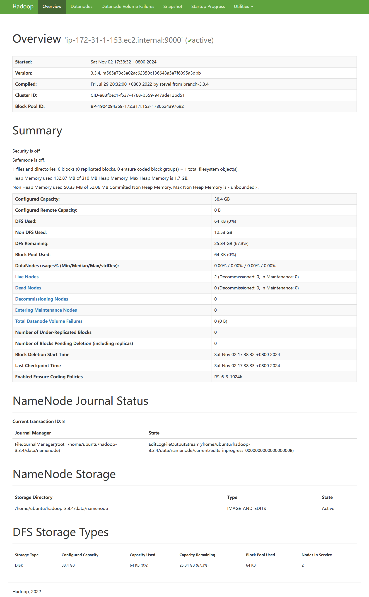
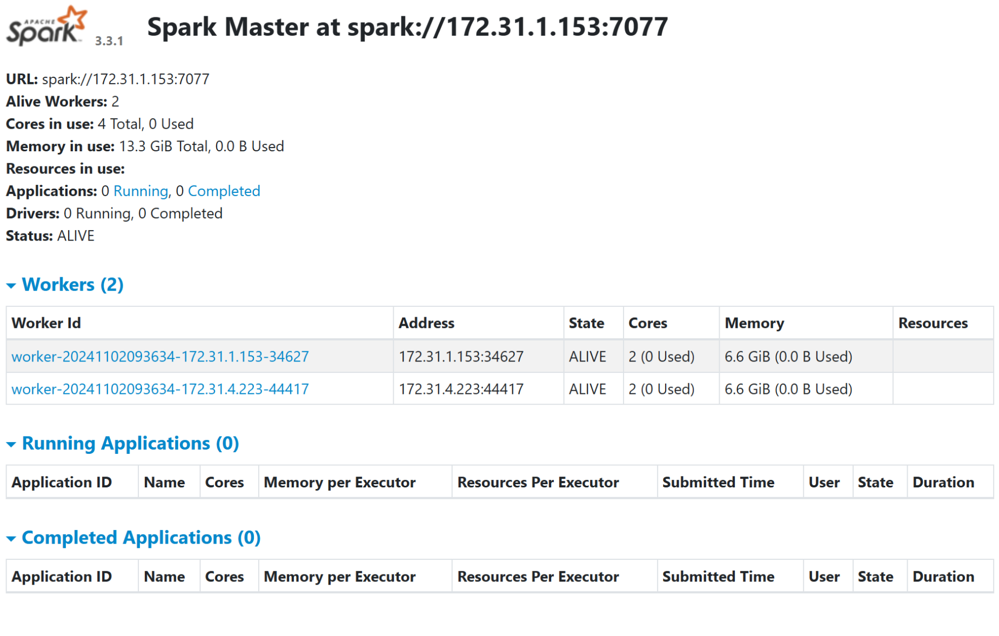
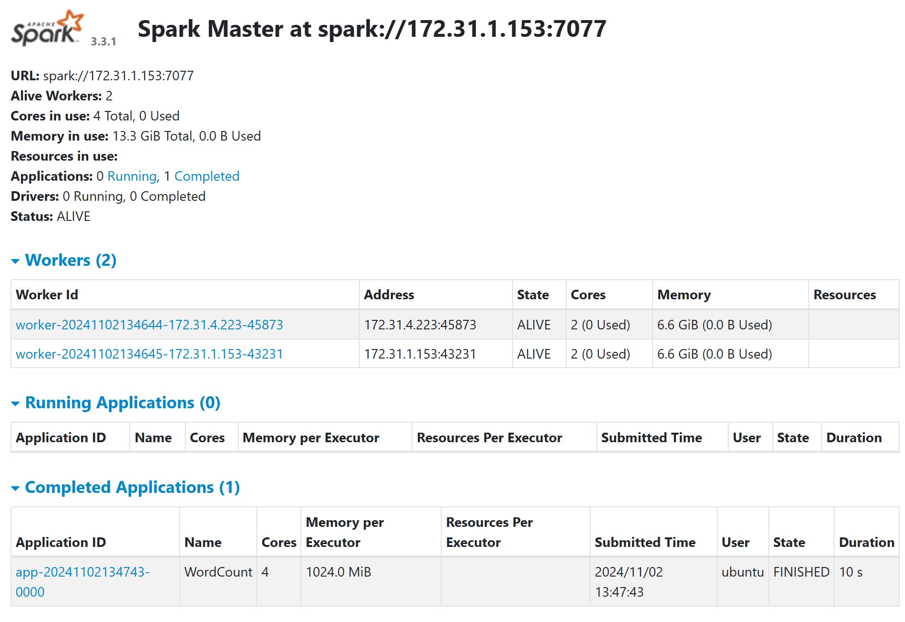
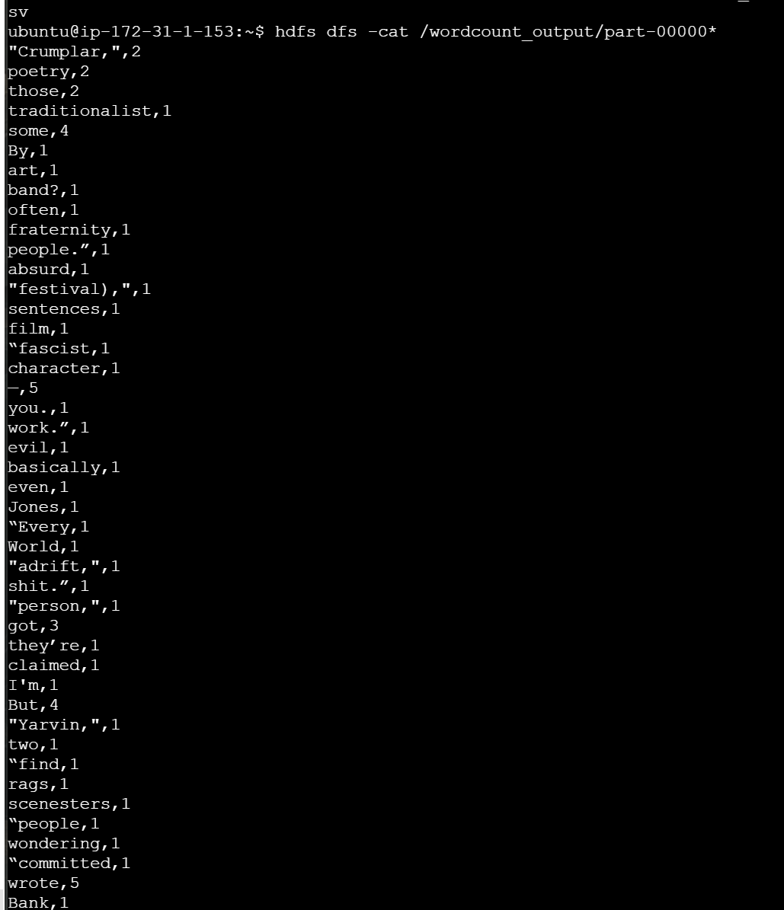

创建两个类型为t3.large的 EC2 VM 实例，vm1 和 vm2, 配置信息：Ubuntu 22.04 LTS, t3.large, 8 + 20 GB

Info: 
vm1
PublicIPs: 44.222.181.130    
PrivateIPs: 172.31.1.153    
vm2
PublicIPs: 3.222.188.23
PrivateIPs: 172.31.4.223   

创建秘钥
ssh-keygen -t rsa
直接全部回车

查看并且复制公钥
cat ~/.ssh/id_rsa.pub
输出
ssh-rsa AAAAB3NzaC1yc2EAAAADAQABAAABgQDBXcAS4HqjeELHUJo/x8tMFmXjiT+AE4t+2M3gvX57kNQGDGzASgASXnW567JZxfk4RvIfK8JGg/Sm2FsZxgFMUreqFdgGP2S3phibW9tT5frBsMXAdsiG2HgT6JbAwbQtBrnvf3n0Y2rdrL2r8YkgTIUj+by/rg4XHsbYS4snbAGnyKPpou5vowzk/WQ+ZDIOLqFc6CG6J33dzCl7gRhAlO0PBfoXrUjp0t1tC5sp2B20wlMUZYa56/Bzk7Pf6LlVOw9cc5Hws0hDcnr6tQstHhC0I6huLOUyDJHPpMW/dT4XNT9zu0P9RKRKAdcmXD+m7Bh/YAJ1mqPfgl+Y+m1RVec2KARoJl3Io6H6Td2HrWyv/wHh4orJafUBguRbCOMWYaR/wI3ThBiqVnEkp9eooqEj4V8Kwe6hfdOBtkr82SQLQhlwVabxaATXpzIYw0fdwZkQZxjcKyGNRjZ8/5/ChyAo/x2DC3Lu7LsttGIcafdDnOye8yssiuA9gw/3988= ubuntu@ip-172-31-1-153

将公钥内容添加到 vm1 的 ~/.ssh/authorized_keys 文件中
echo "ssh-rsa AAAAB3NzaC1yc2EAAAADAQABAAABgQDBXcAS4HqjeELHUJo/x8tMFmXjiT+AE4t+2M3gvX57kNQGDGzASgASXnW567JZxfk4RvIfK8JGg/Sm2FsZxgFMUreqFdgGP2S3phibW9tT5frBsMXAdsiG2HgT6JbAwbQtBrnvf3n0Y2rdrL2r8YkgTIUj+by/rg4XHsbYS4snbAGnyKPpou5vowzk/WQ+ZDIOLqFc6CG6J33dzCl7gRhAlO0PBfoXrUjp0t1tC5sp2B20wlMUZYa56/Bzk7Pf6LlVOw9cc5Hws0hDcnr6tQstHhC0I6huLOUyDJHPpMW/dT4XNT9zu0P9RKRKAdcmXD+m7Bh/YAJ1mqPfgl+Y+m1RVec2KARoJl3Io6H6Td2HrWyv/wHh4orJafUBguRbCOMWYaR/wI3ThBiqVnEkp9eooqEj4V8Kwe6hfdOBtkr82SQLQhlwVabxaATXpzIYw0fdwZkQZxjcKyGNRjZ8/5/ChyAo/x2DC3Lu7LsttGIcafdDnOye8yssiuA9gw/3988= ubuntu@ip-172-31-1-153" >> ~/.ssh/authorized_keys

在 vm2 上创建 authorized_keys 文件，然后将 vm1 的公钥内容粘贴进去
nano ~/.ssh/authorized_keys
按 Ctrl + X 退出编辑器，然后按 Y 保存更改，按 Enter 退出

设置正确的权限
chmod 600 ~/.ssh/authorized_keys

返回 vm1，然后测试无密码 SSH 连接到 vm2
ssh ubuntu@3.222.188.23

## 第1部分 软件部署

下载解压 Hadoop (vm1&2)
cd ~
wget https://archive.apache.org/dist/hadoop/common/hadoop-3.3.4/hadoop-3.3.4.tar.gz
tar -xzvf hadoop-3.3.4.tar.gz

修改配置文件 (vm1&2)
进入~/hadoop-3.3.4/etc/hadoop
nano core-site.xml

edit:
<configuration>
    <property>
        <name>fs.defaultFS</name>
        <value>hdfs://172.31.1.153:9000</value>
    </property>
</configuration>

nano hdfs-site.xml
edit:
<configuration>
    <property>
        <name>dfs.namenode.name.dir</name>
        <value>file:///home/ubuntu/hadoop-3.3.4/data/namenode</value>
    </property>
    <property>
        <name>dfs.datanode.data.dir</name>
        <value>file:///home/ubuntu/hadoop-3.3.4/data/datanode</value>
    </property>
    <property>
        <name>dfs.block.size</name>
        <value>67108864</value> <!-- 64MB -->
        <description>Block size</description>
    </property>
</configuration>

JAVA_HOME设置(vm1&2)
nano hadoop-env.sh
查找并且修改为
export JAVA_HOME=/usr/lib/jvm/java-8-openjdk-amd64/jre
需要去除行首的注释“#”

Ctrl + O; Enter; Ctrl + X

创建目录 (vm1&2)
mkdir -p ~/hadoop-3.3.4/data/namenode
mkdir -p ~/hadoop-3.3.4/data/datanode

复制文件：(vm1->2)
scp ~ /hadoop-3.3.4/etc/hadoop/workers ubuntu@3.222.188.23:~/hadoop-3.3.4/etc/hadoop/

Hadoop 路径: (vm1&2)
打开 .bashrc 文件：
nano ~/.bashrc

添加 Hadoop 路径
export PATH=$PATH:~/hadoop-3.3.4/bin:~/hadoop-3.3.4/sbin

应用更改
source ~/.bashrc

初始化NameNode (vm1) 
hdfs namenode -format

启动 HDFS 集群 (vm1)
start-dfs.sh
如果没有报错，在浏览器里访问 HDFS 仪表板
http://44.222.181.130:9870/dfshealth.html # via vm1 public ip

NEW IP Info:
vm1: PublicIPs: 44.204.182.21    PrivateIPs: 172.31.1.153    
vm2: PublicIPs: 44.195.83.218    PrivateIPs: 172.31.4.223    

访问正常 (vm1)
http://44.204.182.21:9870/dfshealth.html

暂时停止 (vm1) 
stop-dfs.sh

Apache Spark
下载并解压：(vm1&2)
cd ~
wget https://archive.apache.org/dist/spark/spark-3.3.1/spark-3.3.1-bin-hadoop3.tgz
tar -xzvf spark-3.3.1-bin-hadoop3.tgz

配置 (vm1&2)
nano ~/spark-3.3.1-bin-hadoop3/conf/spark-env.sh 

export SPARK_MASTER_HOST=172.31.1.153    # vm1的私有IP
export SPARK_LOCAL_IP=172.31.1.153       # 在vm1上设置为vm1的私有IP，vm2上为vm2的私有IP 
export JAVA_HOME=/usr/lib/jvm/java-8-openjdk-amd64/jre
export PYSPARK_PYTHON=/usr/bin/python3
export PYSPARK_DRIVER_PYTHON=/usr/bin/python3

启动 Spark 集群
~/spark-3.3.1-bin-hadoop3/sbin/start-all.sh

浏览器打开
http://44.204.182.21:8080

NEW IP Info:
vm1: PublicIPs: 44.192.111.214    PrivateIPs: 172.31.1.153   
vm2: PublicIPs: 44.223.99.60    PrivateIPs: 172.31.4.223    

## 实现Spark应用程序-字数统计

下载 wordcount.txt 文件
wget https://raw.githubusercontent.com/CUHKSZ-CSC4160-Fall24/Assignment-4/main/wordcount.txt -O ~/wordcount.txt
cat ~/wordcount.txt # 查看文件内容

将文件上传到 HDFS 并确认
hdfs dfs -copyFromLocal ~/wordcount.txt /
hdfs dfs -ls /

创建并且编写 PySpark 脚本文件 word_count.py
nano ~/word_count.py
[word_count.py](./word_count.py)

运行 spark-submit 提交程序
~/spark-3.3.1-bin-hadoop3/bin/spark-submit ~/word_count.py hdfs://172.31.1.153:9000/wordcount.txt hdfs://172.31.1.153:9000/wordcount_output

如果spark看不了记得编辑 spark-env.sh 文件，加上
export SPARK_PUBLIC_DNS=44.192.111.214 

查看输出列表和文件
hdfs dfs -ls /wordcount_output
hdfs dfs -cat /wordcount_output/part-00000*

# 第 3 部分：PageRank

NEW IP Info:
vm1: PublicIPs: 35.170.65.76    PrivateIPs: 172.31.1.153    
vm2: PublicIPs: 44.200.214.2    PrivateIPs: 172.31.4.223      

PageRank Algorithm: 
Set initial rank of each page to be 1.
On each iteration, each page p contributes to its outgoing neighbors a value of rank(p)/(# of outgoing neighbors of p).
Update each page’s rank to be 0.15 + 0.85 * (sum of contributions).
Go to next iteration.

